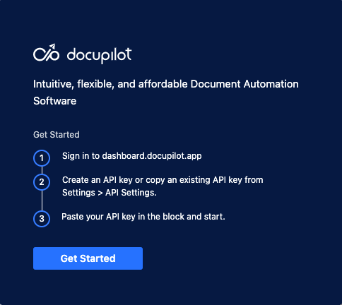
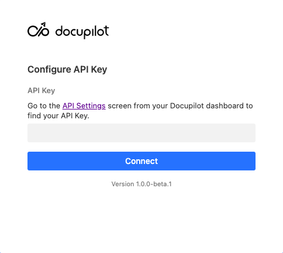
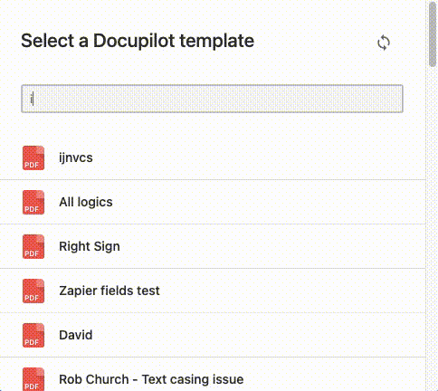
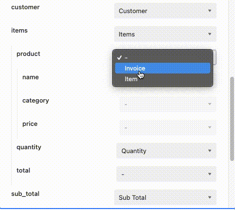
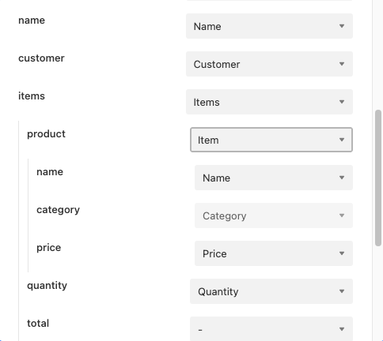
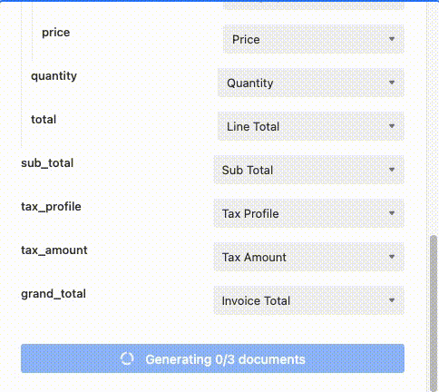

## Docupilot-Airtable integration: How it works

This official integration by [Docupilot](https://docupilot.app) aims to connect Docupilot and Airtable directly.

One/Many documents can be generated from one/more records from a given Airtable's table/view and a selected Docupilot template at a time.

This integration provides intuitve ways to pass data from linked records too _(discussed further below)_.

Let's start with linking Airtable and Docupilot accounts

### Linking Docupilot account



After installing the Docupilot's Airtable app in a base, press "Get Started" in homepage.



Follow instructions in setup page to add necessary credentials and click "Connect".

### Field - Token mapping

On selecting at-least one record from current table, Docupilot templates will be listed in Docupilot's airtable app.



Search for the template required to generate document(s) with selected record(s).

A mapping page will be shown where Docupilot's Template Tokens can be mapped with Airtable's Fields.

##### Automapping

Before generating a document using a template with a given table for the first time,
the App will automatically match Fields from Base and Tokens from Template after
applying following transformations on both sides:
1. lowercase all characters
2. remove all underscores `_`
3. remove all blank spaces ` `



If any fields are not filled by automapping, they can be manually picked.

###### Examples of fields that are auto mapped

| Docupilot Template Token | Airtable Field |
|--------------------------|----------------|
|Customer_Name			   | Customer Name	|
|Item Name			   	   | ItemName       |
|item_price 			   | ITEM PRICE		|
|MAIL TO	 			   | mail_to		|
|Employee_First_Name	   | employee first name|

##### Stickyness in mapping

Once at least one document is generated for a given table & template pair, automapping will not be invoked. Any mapping overrides applied over automapped fields will be saved against table & template pair.

If this mapping is changed when generating document for any records later (again, for the same table & template pair) that changed mapping will override previously saved mapping thereby making the latest mapping available for further generations.

##### Mapping linked records to Nested tokens



Linked records and fields in linked records can be mapped only to Nested tokens.

In the screenshot above, the template may have the following syntax:

```
Category | Name | Unit Price | Quantity | Amount
{{#each items}}
{{product.category}} | {{product.name}} | {{product.price}} | {{quantity}} | {{total}}
{{/each}}
```

### Uploading generated document to a record

Generated document can be uploaded to an attachment field, if available, in the source table respectively against source records.

**Upload document to an attachment field** preference is also sticky and will be stored across different generations.

### Generating documents



Once mapping is complete, clicking on "Create n documents" will start the document creation process.

> Note that this generation process will also trigger any deliveries configured under
> deliveries section in Docupilot.

### Downloading a generated document

Generated documents can be downloaded from the success page by clicking on download button
against each record.

> Note: This option is available only if _"upload document to an attachment field"_ setting is enabled.
